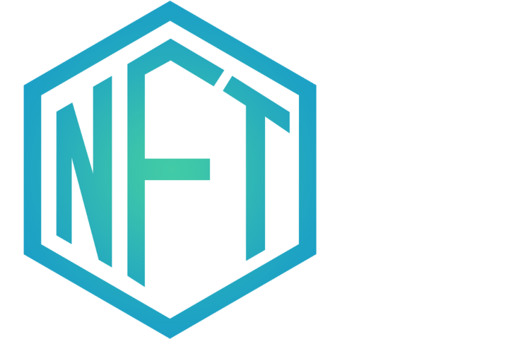

# NFTezz

A platform for creators to tokenize, monetize, and build reputation with their artwork.

<h1 align="center">NFTezz</h1>

    

  <h6>Built at ETHGlobal Metabolism'22 && Web3 Infinity Hackathon</h6>
  
  

  

  
View the project demo on <a href="https://youtu.be/BV7bS3qm4T0">YouTube</a>

Built with React, and powered by **Polygon, NFT.Storage, IPFS & Filecoin, Alchemy & Hardhat**

- Users connect to the Platform via metamask wallet.
- Users can select the type of artwork 'traditional' or 'digital'
- Decription of the NFT artwork
- Country/Region of the creator
- Price in Matic Token
- When the NFT is minted, the metadata is stored to the IPFS permanently using  `NFT.Storage`, and the produced hash is mapped to the NFT item in the smart contract. 
- These minted artworks are shown on the creators dashboard in the Explore Section, where users can buy artwork, for the listed price.
- The funds get deposited from the message.sender to the creator of the tokenised artwork.
- The metadata is fetched using a call via axios to `ipfsGateWayURL = `https://${urlArray[2]}.ipfs.nftstorage.link/${urlArray[3]}`, 
- to fetch the CID(content identifier) from the storage URL 

# Smart Contract & web3 & Technologies
1. `NFTeez.sol` - Solidity & Open Zeppelin
2. `NFT Storage` [Implemetation](https://github.com/lopeselio/NFTezz/blob/master/client/src/components/MintProfile.jsx#L42)
3. Harhat for deployment and testing
4. Alchemy for RPC Infrastructure
5. ReactJS, PostCSS, Axios

# Plans for the future
- Token Gated chat using Lit Protocol for members of the community (Users who mint on our marketplace)
- Carbon offset tokens to be issued for every NFT minted and sold along with a ReFi calendar to award CO2 offset certificates
- Aims to be a green marketplace on Polygon

Contract Addresses:
- Token Address `NFTeez.sol` on Polygon Numbai Testnet : `0x4D2D611a95A7e724F736028611BA95D1fdc9cE5D` View here: [Etherescan Explorer](https://mumbai.polygonscan.com/address/0x4D2D611a95A7e724F736028611BA95D1fdc9cE5D)

